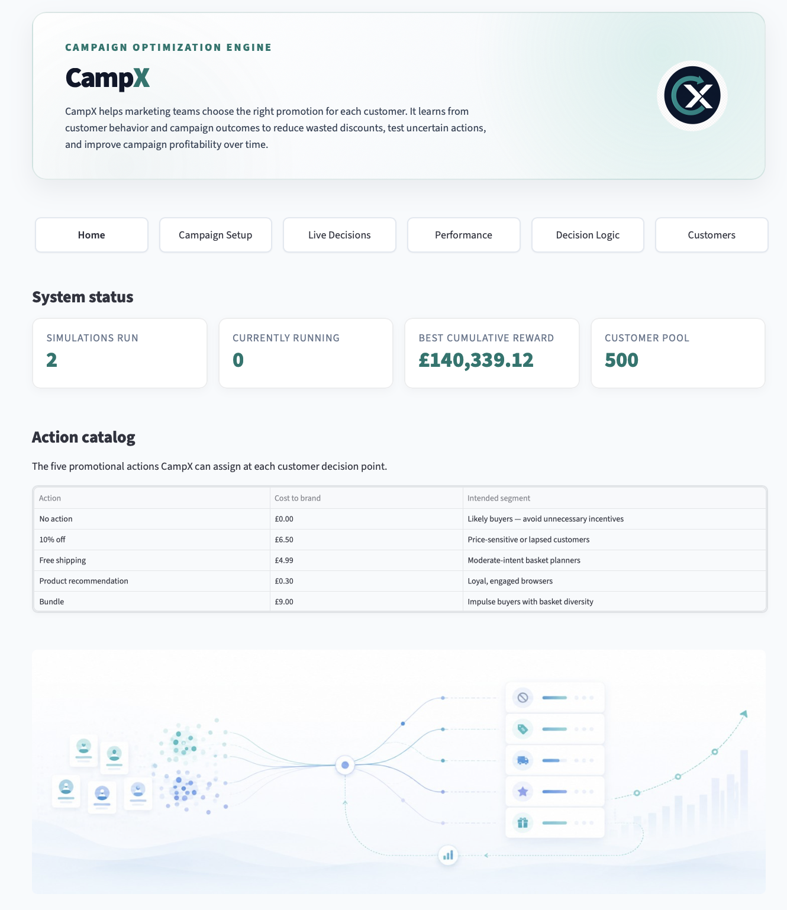

# Frontend App — Streamlit

## Overview

The CampX frontend is a Streamlit multi-page app that connects to the FastAPI backend and provides an interactive dashboard for campaign management and analysis.

 

App URL (local):

```
http://localhost:8501
```

## Pages

| Page | File | Purpose |
|------|------|---------|
| Home | `app.py` | Product overview, navigation, and key metrics summary |
| Campaign Setup | `pages/1_create_simulation.py` | Configure and launch a new campaign run; review existing runs |
| Live Decisions | `pages/2_interaction.py` | Monitor reward per round and action selection over time |
| Performance | `pages/3_analytics.py` | Cumulative campaign value, policy summary, action distribution, conversion by action, segment performance |
| Decision Logic | `pages/4_model.py` | Inspect learned LinUCB weights, promotion selection volume, and per-customer action score breakdown |
| Customers | `pages/5_customers.py` | Browse and filter customer profiles by segment and RFM features; view interaction history |

## Design Notes

- All pages use a shared `bandit_utils.py` helper module for API calls, formatting, and UI components.
- Navigation is rendered as a tab bar at the top of every page.
- Charts use native Streamlit components (`st.line_chart`, `st.bar_chart`, `st.area_chart`, `st.dataframe`).
- The sidebar campaign run selector is shared across Performance, Live Decisions, Decision Logic, and Customers.
- The DS container runs as a batch job and exits with code 0 after persisting data. The frontend does not depend on it being running.

## Frontend Reference

### `bandit_utils.py`

::: campx.app.bandit_utils
