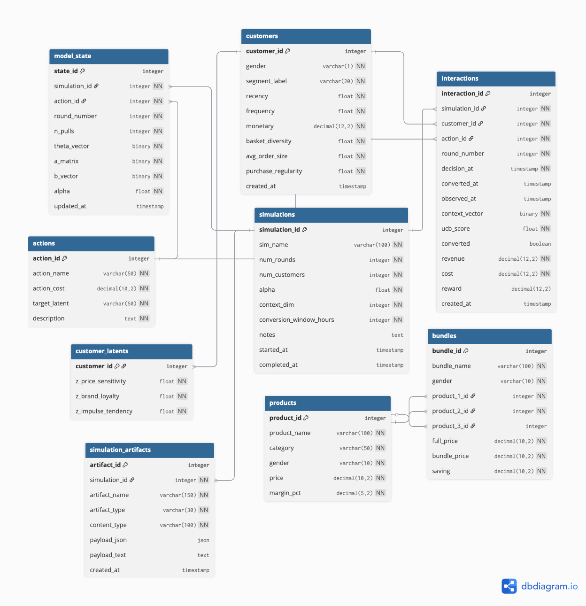

# Database — PostgreSQL

**Owner:** Hayk Alekyan · Branch: `db`

---

## ERD



## Schema overview

Nine tables in three layers.

**Simulation layer** — generated once before bandit runs:

| Table | Purpose |
|-------|---------|
| `customers` | One row per simulated customer — RFM context vector for LinUCB |
| `customer_latents` | Simulation-only hidden variables — latent traits that generated RFM features and drive simulated conversion |
| `products` | Static fashion product catalog included as scaffolding for future item-level personalization |
| `bundles` | Pre-defined curated outfits included as scaffolding for future bundle-level personalization |

The current MVP does not select exact product SKUs or exact bundle configurations. The bandit selects promotional action types.

**Bandit layer** — grows during simulation:

| Table | Purpose |
|-------|---------|
| `actions` | 5 promotional arms — static, seeded once |
| `simulations` | One row per experiment run |
| `interactions` | Every (customer, action, reward) decision — core training log |
| `model_state` | LinUCB A, b, θ per action — persists across container restarts |

**Artifact layer** — stores generated file payloads after the local CSV/report
directory is written:

| Table | Purpose |
|-------|---------|
| `simulation_artifacts` | JSON/text payloads for generated DS files keyed by simulation |

The DS generator keeps the local artifacts and then loads those files into the
database.

---

## Schema files

The schema is split across five files, run in order by PostgreSQL on first container start:

| File | Contents |
|------|---------|
| `db/1_schema.sql` | All table definitions |
| `db/2_indexes.sql` | Performance indexes |
| `db/3_initial_insert.sql` | Seed data — actions, products, bundles |
| `db/4_views.sql` | Read views for customer latents and simulation summaries |
| `db/5_stored_procedures.sql` | Write procedures for customer upsert, interaction logging, and feedback |

---

## Time dimension in `interactions`

Three timestamps capture the decision-to-outcome gap:
```
decision_at   ← when the system assigned the action
│
│  [conversion_window_hours — default 48h]
│
converted_at  ← when purchase occurred (NULL until observed)
observed_at   ← when model received outcome and updated
```

`converted`, `revenue`, `reward` are NULL until `observed_at` is set.
In the MVP, outcomes are generated by the DS batch workflow or API simulation logic. A future scheduled workflow could handle delayed outcome observation after the conversion window.

---

## Setup

```bash
docker-compose up db pgadmin
```

Schema initialises automatically. All 8 tables and seed data are created on first start.

---

## pgAdmin setup (first time only)

pgAdmin does not auto-connect. After running the command above:

1. Open http://localhost:5050
2. Login: `admin@admin.com` / `admin123`
3. Right-click **Servers** → **Register** → **Server**
4. **General tab** — Name: `campaign`
5. **Connection tab**:
   - Host: `db`
   - Port: `5432`
   - Database: `campaign`
   - Username: `campaign_user`
   - Password: `campaign_pass`
   - Save password: on
6. Click **Save**

Navigate to:
`Servers → campaign → Databases → campaign → Schemas → public → Tables`

You should see 9 tables. `actions` has 5 rows, `products` has 12 rows, `bundles` has 6 rows.

---

## CRUD helpers

All DB access goes through `campx/api/db_interactions.py`. No raw SQL elsewhere.
Every function takes a `SQLHandler` instance as its first argument.

```python
from SQLHandler import SQLHandler
import db_interactions as dbi
```
```
db = SQLHandler(
    host=os.getenv("DB_HOST", "db"),
    dbname=os.getenv("POSTGRES_DB", "campaign"),
    user=os.getenv("POSTGRES_USER", "campaign_user"),
    password=os.getenv("POSTGRES_PASSWORD", "campaign_pass"),
)
```

# Customers
```
dbi.get_all_customers(db)
dbi.get_customer_by_id(db, customer_id)
dbi.get_customer_latents(db, customer_id)
dbi.insert_customer(db, gender, segment_label, recency, frequency,
                    monetary, basket_diversity, avg_order_size, purchase_regularity)
dbi.insert_customer_latent(db, customer_id, z_price_sensitivity,
                           z_brand_loyalty, z_impulse_tendency)
```

# Interactions
```
dbi.log_interaction(db, simulation_id, customer_id, action_id,
                    round_number, context_vector_bytes, ucb_score, cost)
dbi.observe_outcome(db, interaction_id, converted, revenue,
                    converted_at, observed_at)
dbi.get_pending_interactions(db, older_than_hours=48)
```

# Model state
```
dbi.get_model_state(db, simulation_id, action_id)
dbi.upsert_model_state(db, simulation_id, action_id, round_number,
                       n_pulls, theta_bytes, a_bytes, b_bytes, alpha)
```

# Simulations
```
dbi.create_simulation(db, sim_name, num_rounds, num_customers, alpha)
dbi.complete_simulation(db, simulation_id)
```

# DS artifacts
```
dbi.upsert_simulation_artifact(db, simulation_id, artifact_name,
                               artifact_type, content_type,
                               payload_json=rows_or_object)
dbi.list_simulation_artifacts(db, simulation_id)
dbi.get_simulation_artifact(db, simulation_id, artifact_name)
```
